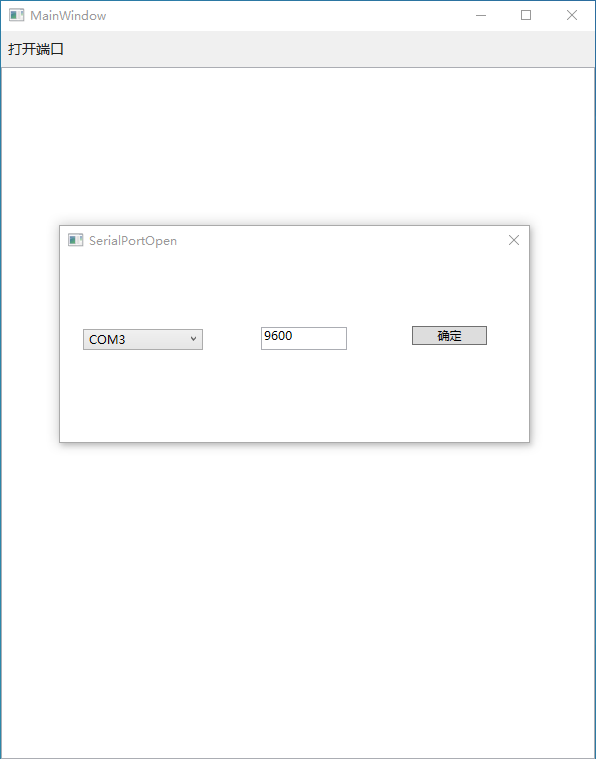
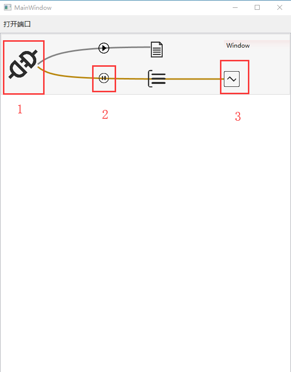
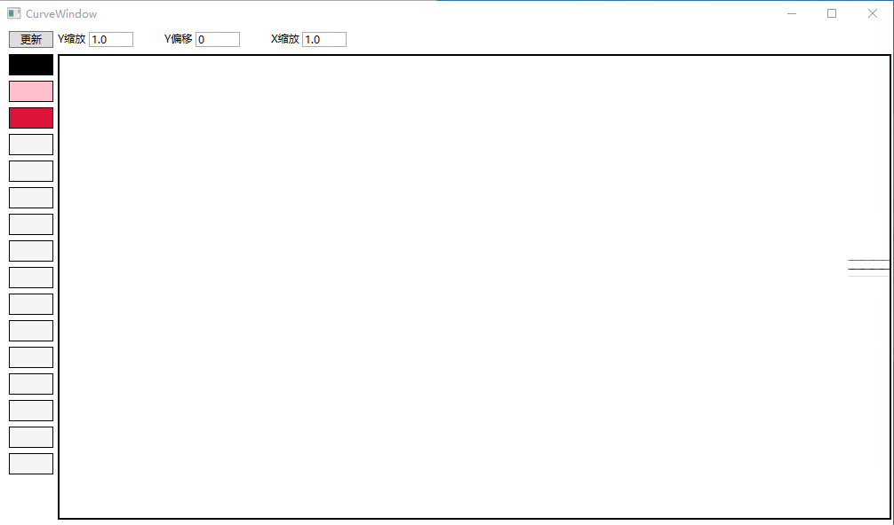
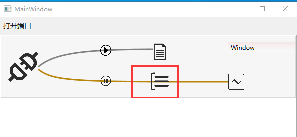
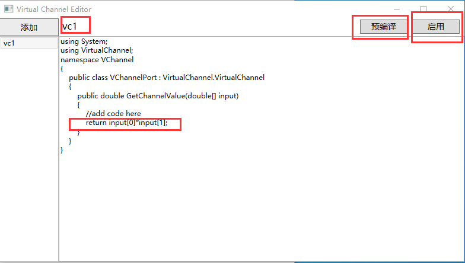
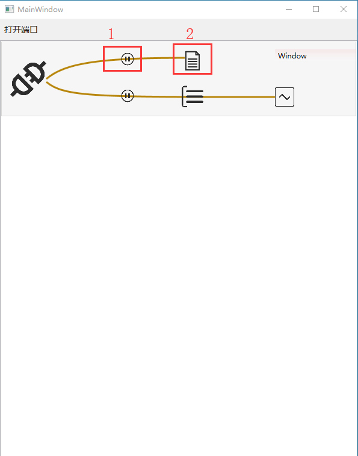

# 说明
  该软件是一个绘制串口或网口时域数据的工具。例如有串口持续输出`1,2\r\n`的数据，假设第一个数据为电流，第二个数据为电压，那么该工具就能绘制关于电流电压的曲线。同时该工具还支持通过现场编辑C#代码，增加第三条功率曲线。此外，工具还能将数据保存为csv格式的文件，后续将会支持保存为py格式的文件，以方便在python中分析处理。

  工具默认支持串口，且串口输出数据的格式为`数据1,数据2,...,数据n\r\n`。串口输出多少个数据就会绘制多少组数据，但是曲线绘制窗口最多支持16条曲线。另外，工具支持插件开发，以支持不同的数据格式或不同的端口；工具默认支持的串口就是通过插件实现的。
# 操作截图
1. 打开软件，并打开一个默认串口，打开后的图如下

2. 依次点击下图中标识的按钮，分别表示打开端口、打开曲线绘制数据流、打开曲线窗口

3. 点击红色矩形框住的图表，打开代码编辑界面，并编辑代码。【预编译】可以检查代码是否可以编译通过，【启用】可以启用或更新代码。

4. 点击下图1号框可以启用数据保存流，2号框可以打开文本对话框，用来确定文件保存位置

